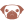

  <h3>
    
    Dev Stack Logos
    
  </h3>
  

  A curated collection of copy-paste SVG tech logos to beautify your GitHub Profile README.
  

  <h3>
    How to use:
  </h3>
  

    Using these logos is completely <b>frictionless</b>! No packages to install, no files to download.
  

  <ol>
    <li>
      <b>Find your tech:</b> Browse the 
      <a href="#tech-stack">
        Teck Stack Index
      </a>below.
    </li>
    <li>
      <b>Click & Copy:</b> Click on any logo to jump directly to its HTML snippet.
    </li>
    <li>
      <b>Paste:</b> Paste the code directly into your GitHub Profile `README.md`!
    </li>
  </ol>

  <table>
    <tr>
      <th>Stack</th>
      <th>Languages / Frameworks / Libs</th>
    </tr>
    <tr>
      <td>Frontend</td>
      <td>
        
        
        
        
        
        
        
        
        
        
        
        
        
        
        
        
        
        
        
        
        
        
        
        
        
        
        
        
        
        
        
        
        
        
        
        
        
        
        
        
        
        
        
        
      </td>
    </tr>
    <tr>
      <td>Backend</td>
      <td>
        
        
        
        
        
        
        
      </td>
    </tr>
    <tr>
      <td>Tools</td>
      <td>
        
        
        
        
        
        
        
        
        
        
      </td>
    </tr>
  </table>

  <h3>Resources:</h3>
  

    <h4>HTML5</h4>

    

  

    <h4>CSS3</h4>

    

  

    <h4>SASS (SCSS)</h4>

    

  

    <h4>TailwindCss</h4>

    

  

    <h4>Bootstrap</h4>

    

  

    <h4>JavaScript</h4>

    

  

    <h4>TypeScript</h4>

    

  

    <h4>React</h4>

    

  

    <h4>Vue</h4>

    

  

    <h4>Angular</h4>

    

  

    <h4>Next</h4>

    

  

    <h4>Nuxt</h4>

    

  

    <h4>Axios</h4>

    

  

    <h4>Redux</h4>

    

  

    <h4>React Router</h4>

    

  

    <h4>React Query</h4>

    

  

    <h4>React Hook Form</h4>

    

  

    <h4>Formik</h4>

    

  

    <h4>Zod</h4>

    

  

    <h4>Zustand</h4>

    

  

    <h4>Shadcn</h4>

    

  

    <h4>MUI</h4>

    

  

    <h4>AntDesign</h4>

    

  

    <h4>Three.js</h4>

    

  

    <h4>Svelte</h4>

    

  

    <h4>React Flow</h4>

    

  

    <h4>Electron</h4>

    

  

    <h4>Tauri</h4>

    

  

    <h4>PWA</h4>

    

  

    <h4>Pinia</h4>

    

  

    <h4>Astro</h4>

    

  

    <h4>GSAP</h4>

    

  

    <h4>Graphql</h4>

    

  

    <h4>i18next</h4>

    

  

    <h4>Styled-Components</h4>

    
  

    <h4>Vuetify</h4>

    

  

    <h4>Vite</h4>

    

  

    <h4>Vitest</h4>

    

  

    <h4>Cypress</h4>

    

  

    <h4>Webpack</h4>

    

  

    <h4>Postcss</h4>

    

  

    <h4>Eslint</h4>

    

  

    <h4>EJS</h4>

    

  

    <h4>Pug</h4>

    

<!-- Backend -->

  

    <h4>Node.js</h4>

    

  

    <h4>Express.js</h4>

    

  

    <h4>NestJS</h4>

    

  

    <h4>Redis</h4>

    

  

    <h4>SQLite</h4>

    

  

    <h4>MySQL</h4>

    

  

    <h4>PostgreSQL</h4>

    

<!-- Tools -->

  

    <h4>Linux</h4>

    
    
  

    <h4>Git</h4>

    

  

    <h4>GitHub</h4>

    

  

    <h4>Docker</h4>

    

  

    <h4>VsCode</h4>

    

  

    <h4>Figma</h4>

    

  

    <h4>NPM</h4>

    

  

    <h4>PNPM</h4>

    

  

    <h4>Yarn</h4>

    

  

    <h4>Bun</h4>

    

